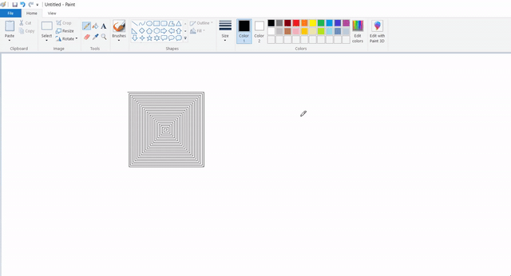

# Python-Auto-Draw

##### THIS SIMPLE PROJECT WAS MADE TO LEARN PYTHON LIBRARY FUNCTIONS LIKE `pyautogui` & `time`.

### *DEMO*:

### To run it on your PC:
* Make sure you have Python 3.7.x or Python 3.8.x installed, if not, click [here](https://www.python.org/downloads/) to install! 
* Install PyAutoGUI: `pip install pyautogui`
* Clone this into your Desktop: `git clone "https://github.com/Ishika63/Python-Auto-Draw.git"`
* Open Command Line or Terminal 
* Change directory to a respective game: `cd "Desktop\Python-Auto-Draw"`
* Run: `python python-auto-draw.py`
* Then, switch tabs, and open PAINT. Place the cursor on the white board.
* *ENJOY*

### BASICS:
<code>
>>> import pyautogui
</code>

`>>> screenWidth, screenHeight = pyautogui.size()` # Get the size of the primary monitor.

`>>> currentMouseX, currentMouseY = pyautogui.position()` # Get the XY position of the mouse.

`>>> pyautogui.moveTo(100, 150)` # Move the mouse to XY coordinates.

`>>> pyautogui.click()`          # Click the mouse. 
`>>> pyautogui.click(100, 200)`  # Move the mouse to XY coordinates and click it. 
`>>> pyautogui.click('button.png')` # Find where button.png appears on the screen and click it. 

`>>> pyautogui.move(0, 10)`      # Move mouse 10 pixels down from its current position. 
`>>> pyautogui.doubleClick()`    # Double click the mouse. 
`>>> pyautogui.moveTo(500, 500, duration=2, tween=pyautogui.easeInOutQuad)`  # Use tweening/easing function to move mouse over 2 seconds. 

`>>> pyautogui.write('Hello world!', interval=0.25)`  # type with quarter-second pause in between each key 
`>>> pyautogui.press('esc')`     # Press the Esc key. All key names are in pyautogui.KEY_NAMES 

`>>> pyautogui.keyDown('shift')` # Press the Shift key down and hold it. 
`>>> pyautogui.press(['left', 'left', 'left', 'left'])` # Press the left arrow key 4 times. 
`>>> pyautogui.keyUp('shift')`   # Let go of the Shift key. 

`>>> pyautogui.hotkey('ctrl', 'c')` # Press the Ctrl-C hotkey combination. 

`>>> pyautogui.alert('This is the message to display.')` # Make an alert box appear and pause the program until OK is clicked. 

## *REFERENCES*:
- [PyAutoGUI Docs](https://pypi.org/project/PyAutoGUI/)
- [More about PyAutoGUI](https://pyautogui.readthedocs.io/en/latest/mouse.html#mouse-drags)
- [Automate the Boring Stuff with Python](https://automatetheboringstuff.com/chapter18/)
